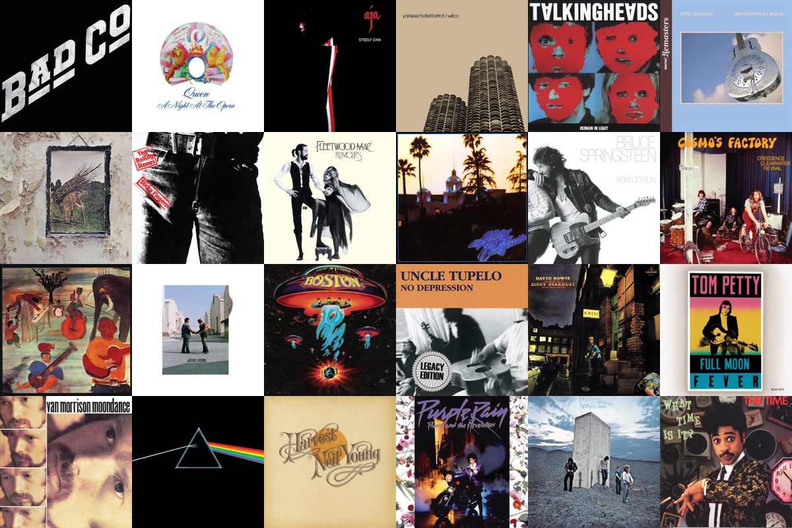

# Coverwall

A macOS screensaver that fills your screen with a wall of album art from your
Spotify listening. Every few seconds a tile crossfades to another album —
your recent plays, your top tracks, or your Liked Songs.



*The mosaic, as rendered by the screensaver. Before you connect Spotify it
shows a snapshot of the global charts; after, it's all you.*

## How it works

Coverwall is two pieces that share one local cache:

- **Coverwall.app** — a small menu-bar helper. It handles the Spotify login
  (OAuth with PKCE — no passwords, no secrets), refreshes your art on a
  schedule (every 15 minutes for recent plays), and installs the screensaver
  for you. Tokens live in the macOS Keychain.
- **Coverwall.saver** — the actual screensaver. It is fully offline: it only
  reads the cached images the helper wrote, so it never blocks, never phones
  home, and keeps working (with slightly stale art) when you're offline.

Nothing ever leaves your Mac — there's no backend, no analytics, and no
data collection. Album art is cached locally (capped at 200 covers) purely
for display.

## Install

### Homebrew

```sh
brew install juettner/coverwall/coverwall
```

### Manual

Download `Coverwall.dmg` from the
[latest release](https://github.com/juettner/coverwall/releases), open it,
and drag **Coverwall** to Applications.

### First run

1. Open **Coverwall.app**. It installs the screensaver and appears in your
   menu bar (grid icon). You'll immediately get the global-charts starter
   wall.
2. Click the menu-bar icon → **Connect Spotify…** and approve access.
   Coverwall asks only for read access to your listening history and
   library — it can't control playback or change anything.
3. Open **System Settings › Screen Saver** and choose **Coverwall**.

> **Heads up:** while Coverwall's Spotify app is in development mode, logins
> are limited to invited accounts. Open an issue with your Spotify email if
> you'd like access.

## Settings

From the menu bar (**Settings…**) or the screensaver's **Options…** sheet:

| Setting | Choices | Default |
|---|---|---|
| Art source | Recently played · Top tracks (4 weeks / 6 months / all time) · Liked Songs | Recently played |
| Tile size | Small · Medium · Large | Medium |
| Flip speed | Every 2–15 seconds | 4 s |
| Track labels | Show artist and title when a tile flips | Off |

The grid never shows the same album twice unless you have fewer albums than
tiles, and flips only bring in albums that aren't already on screen.

## Building from source

Requirements: Xcode 15+, [XcodeGen](https://github.com/yonaskolb/XcodeGen)
(`brew install xcodegen`).

```sh
git clone https://github.com/juettner/coverwall.git
cd coverwall

# Core logic + tests (45 unit tests, no simulator needed)
cd CoverwallShared && swift test && cd ..

# Generate the Xcode project and build the apps
xcodegen
open Coverwall.xcodeproj
```

| Target | What it is |
|---|---|
| `CoverwallShared` | Swift package: Spotify client, PKCE, cache, manifest, mosaic view — all the logic, all the tests |
| `Coverwall` | Menu-bar helper app |
| `CoverwallSaver` | The `.saver` bundle |
| `CoverwallPreview` | Dev harness that runs the mosaic in a window |
